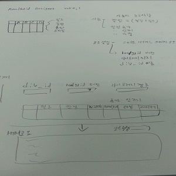

# designer

### RealGridDesigner

RealGrid를 사용하여 RealGridjs버전의 그리드 생성시에 필요한 기초 설정을 간단하게 세팅할 수 있습니다. 

## designer 구상 및 계획

### 버전 0.1

1. designer 요구사항

* 기능 및 설계
* 사용자 - 컬럼추가, 삭제, 속성수정 
* 코드생성 - 그리드에 들어갈 html페이지 소스코드생성 
* (realgrid버전, 라이브러리 파일위치, div_id)

2. 진행사항

* designer로 활용할 그리드 생성(필드, 컬럼, width, type, editor, style)
* 생성된 그리드의 기능 추가(컬럼추가, 컬럼삭제)
* designer의 기본 html소스코드 생성
* 생성된 소스코드로 결과 화면 출력

### 버전 0.3

### 버전 0.5

### 버전 0.6

