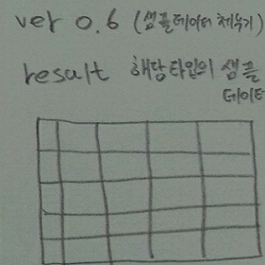
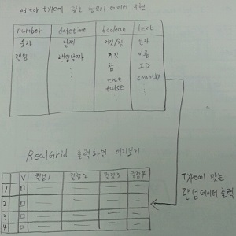

# RealGridDesigner

별다른 설치과정 없이 한번의 클릭으로 제품을 사용할 수 있도록 서비스 제공
직접 소스코드 입력 방식이 아닌 디자이너를 활용하여 보다 쉽게 그리드를 생성할 수 있도록 RealGridDesigner제공

* RealGridDesigner를 활용하여 그리드 구현의 기본 세팅시간을 단축
* 복잡하고 많은 컬럼 생성시 빠른 컬럼 생성이 가능
* 원하는 타입의 포맷 형식을 간단한 선택으로 해당 컬럼의 타입을 지정
* RealGrid사용자에게 보다 편하고 정확하게 Grid를 구현할수 있도록 서비스 제공

## 사용법

RealGrid를 사용하여 RealGridjs버전의 그리드 생성시에 필요한 기초 설정을 간단하게 세팅할 수 있습니다. 

* 그리드에 기본 library경로 및 버전을 지정한다.
* RealGridDesigner에 생성되어 있는 그리드에 컬럼을 추가하여 원하는 행을 만든다. 
* 생성된 각 컬럼의 필드 정보부터 style까지 속성을 설정한다.
* editor와 sytle은 버튼을 눌러 해당 type에 맞는 디자이너화면을 출력하여 format을 입력한다.
* 컬럼 생성이 완료 되면 RealGird HTML Text출력의 미리보기를 선택하여 출력되는 html문서를 확인한다.
* html문서에 이상이 없으면 RealGrid출력화면 미리보기에서 designerView버튼으로 사용할 그리드의 결과물을 확인한다.
* 그리드 미리보기 화면에 이상이 없으면 미리보기 화면으로 구성된 html코드를 파일로 추출하여 사용한다.

그리드 디자이너로 구현할 수 있는 기능 외의 기능은 추출된 파일에 원하는 기능을 추가하여 구현할 수 있습니다.

## designer 구상 및 계획

### 버전 0.1

1). designer 요구사항

* 기능 및 설계
* 사용자 - 컬럼추가, 삭제, 속성수정 
* 코드생성 - 그리드에 들어갈 html페이지 소스코드생성 
* (realgrid버전, 라이브러리 파일위치, div_id)
* 미리보기 - 생성된 소스코드로 RealGrid화면 출력

2). 진행사항

[버전0.1 진행사항 보기](https://github.com/realgrid/designer/releases)

### 버전 0.3

1). 버전 0.3 구상 및 설계

   designer 버전 0.1에서 생성한 그리드의 type, editor, style기능 추가

* type - text, number, datetime, boolean, dropdown
* editor - 컬럼 속성(readOnly:true) 편집불가 상태 속성보기 버튼 구현
* 속성보기 - 해당 타입에 맞는 designer창 열기, 기본 속성값 설정, 직접입력, help버튼 구현

2). 진행사항 

[버전0.3 진행사항 보기](https://github.com/realgrid/designer/releases)

### 버전 0.5

1). 버전 0.5 구상 및 설계

   버전 0.3에서 구성된 editor의 설정에 따라 style컬럼의 속성을 설정하는 기능 추가

* style컬럼의 더보기 버튼클릭으로 해당 타입의 styleDesigner창으로 이동
* styleDesigner - background, textAlignment, type에 맞는 format형식 제공
* editor에 설정한 editorDesigner의 값을 styleDesigner의 format에 입력
* help버튼을 추가하여 설정방법에 대한 정보 제공
* 확인 버튼을 추가하여 완료시 해당 속성의 값을 style데이터셀의 값으로 입력 

2). 진행사항

### 버전 0.6

1). 랜덤 샘플 데이터 출력

   버전 0.5 까지 구현된 컬럼들의 설정을 기반으로 출력 미리보기에 출력된 그리드에 컬럼 속성에 맞는 샘플데이터 출력

* editorType에 맞는 형식의 샘플 데이터 구현
* number - 랜덤 숫자(소수점 포함) [100000, 123456789, 0.123456, ...]
* datetime - 랜덤 날짜 ["20160622", "20160222", ...]
* boolean - 참/거짓, true, false...["참", "거짓", "f", "t", ...]
* text - name, ID, country...["France", "VINET", "random", ...]

2). 진행사항