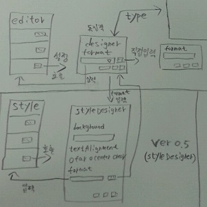

# designer

### RealGridDesigner

RealGrid를 사용하여 RealGridjs버전의 그리드 생성시에 필요한 기초 설정을 간단하게 세팅할 수 있습니다. 

## designer 구상 및 계획

### 버전 0.1

1). designer 요구사항

* 기능 및 설계
* 사용자 - 컬럼추가, 삭제, 속성수정 
* 코드생성 - 그리드에 들어갈 html페이지 소스코드생성 
* (realgrid버전, 라이브러리 파일위치, div_id)
* 미리보기 - 생성된 소스코드로 RealGrid화면 출력

2). 진행사항

* designer로 활용할 그리드 생성(필드, 컬럼, width, type, editor, style)
* 생성된 그리드의 기능 추가(컬럼추가, 컬럼삭제)
* designer의 기본 html소스코드 생성
* 생성된 소스코드로 결과 화면 출력

### 버전 0.3

1). 버전 0.3 구상 및 설계

   designer 버전 0.1에서 생성한 그리드의 type, editor, style기능 추가

* type - text, number, datetime, boolean, dropdown
* editor - 컬럼 속성(readOnly:true) 편집불가 상태 속성보기 버튼 구현
* 속성보기 - 해당 타입에 맞는 designer창 열기, 기본 속성값 설정, 직접입력, help버튼 구현

2). 진행사항 

### 버전 0.5

1). 버전 0.5 구상 및 설계

   버전 0.3에서 구성된 editor의 설정에 따라 style컬럼의 속성을 설정하는 기능 추가

* style컬럼의 더보기 버튼클릭으로 해당 타입의 styleDesigner창으로 이동
* styleDesigner - background, textAlignment, type에 맞는 format형식 제공
* editor에 설정한 editorDesigner의 값을 styleDesigner의 format에 입력
* help버튼을 추가하여 설정방법에 대한 정보 제공
* 확인 버튼을 추가하여 완료시 해당 속성의 값을 style데이터셀의 값으로 입력 

2). 진행사항

### 버전 0.6

1). 랜덤 샘플 데이터 출력

   버전 0.5 까지 구현된 컬럼들의 설정을 기반으로 출력 미리보기에 출력된 그리드에 컬럼 속성에 맞는 샘플데이터 출력

* editorType에 맞는 형식의 샘플 데이터 구현
* number - 랜덤 숫자(소수점 포함) [100000, 123456789, 0.123456, ...]
* datetime - 랜덤 날짜 ["20160622", "20160222", ...]
* boolean - 참/거짓, true, false...["참", "거짓", f, t, ...]
* text - name, ID, country...["France", "VINET", "random", ...]

2). 진행사항